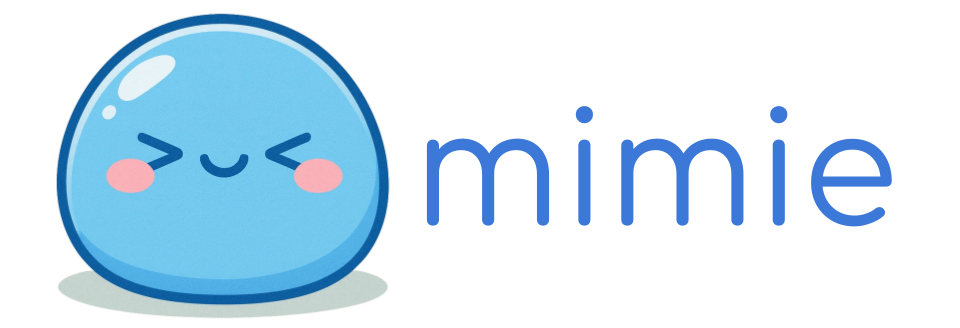

# 🌐 mimie 🚀

_A unified, batteries-included client for embedding APIs that actually works._

**The world of embedding API clients is broken.**

- Everyone defaults to OpenAI's client for embeddings, even though it wasn't designed for that purpose
- Provider-specific libraries (VoyageAI, Cohere, etc.) are inconsistent, poorly maintained, or outright broken
- Universal clients like LiteLLM and any-llm-sdk don't focus on embeddings at all—they rely on native client libraries, inheriting all their problems
- Every provider has different capabilities—some support dimension changes, others don't—with no standardized way to discover what's available
- Most clients lack basic features like retry logic, proper error handling, and usage tracking
- There's no single source of truth for model metadata, pricing, or capabilities

**Mimie fixes this.** It's a lightweight, unified client built specifically for embeddings with:

🎯 A clean, consistent API across all providers
🔄 Built-in retry logic with exponential backoff
💰 Automatic usage and cost tracking
📚 Rich model metadata and capability discovery
⚠️ Proper error handling and type hints
⚡ First-class support for both sync and async
